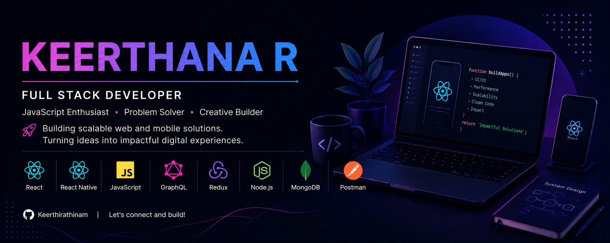

<p align="center">
  
</p>

<p align="center">
  
</p>

---

## 🌸 About Me

```javascript
const keerthana = {
  role: "Full Stack Developer 🚀",
  background: "React Native (3+ years)",
  stack: ["React", "Node.js", "MongoDB", "React Native"],
  focus: "Scalable Web & Mobile Apps",
  goal: "Building Great Products"
};
```

💼 3+ years of professional experience building mobile applications with React Native

🌐 Expanding into Full Stack Development with React, Node.js, MongoDB, APIs, and System Design

🧠 Passionate about building scalable products from frontend experiences to backend services

🚀 Continuously learning through real-world projects and hands-on development

🌱 Building today with the skills needed for tomorrow

---

## 🛠️ My Tech Stack

<p align="center">
  
</p>

<p align="center">
  React Native • React • JavaScript • Node.js • MongoDB • GraphQL • Redux • Postman • System Design
</p>

---

## 🎯 Current Focus

<table>
<tr>
<td>🌐 Full Stack Apps</td>
<td>🔧 Backend APIs</td>
</tr>
<tr>
<td>🧠 System Design</td>
<td>🔐 Authentication</td>
</tr>
<tr>
<td>☁️ Cloud & Deployment</td>
<td>🚀 Side Projects</td>
</tr>
</table>

---

## 🔥 Contribution Streak

<p align="center">
  
</p>

---

## 🌷 Philosophy

> Build products, not just features.
>
> Learn deeply.
>
> Stay curious.
>
> Improve consistently.
>
> Growth compounds over time.

---

## 🤝 Let's Connect

<p align="center">

🚀 React Native Developer → Full Stack Engineer

📱 3+ Years Mobile Development Experience

🌱 Currently Building End-to-End Applications

</p>

<p align="center">
  ☕ Always happy to discuss engineering, architecture, and product development.
</p>

---

## 🐍 Contribution Snake

<p align="center">
  
</p>

---

## 📈 Contribution Graph

<p align="center">
  
</p>

---

<p align="center">
  ✨ Thanks for stopping by ✨
  <br/>
  🌱 Growing one commit at a time. 🚀
</p>
